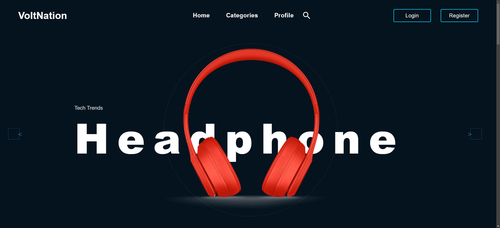
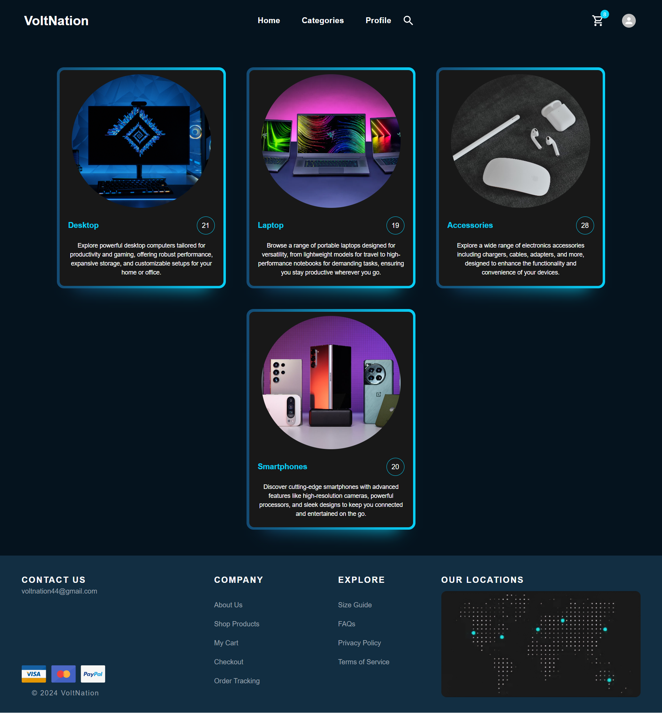
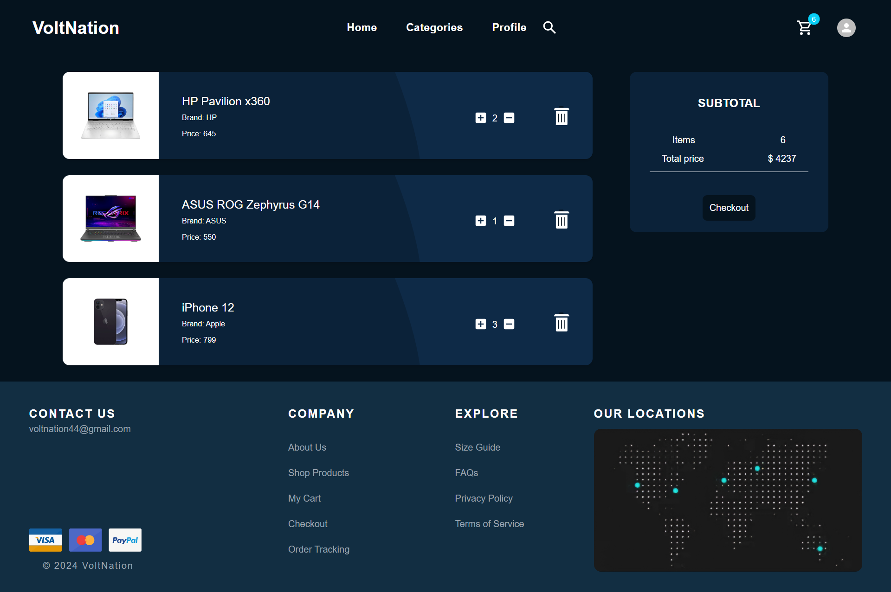
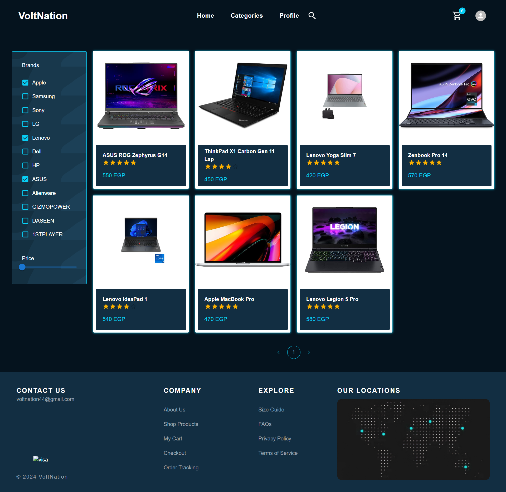
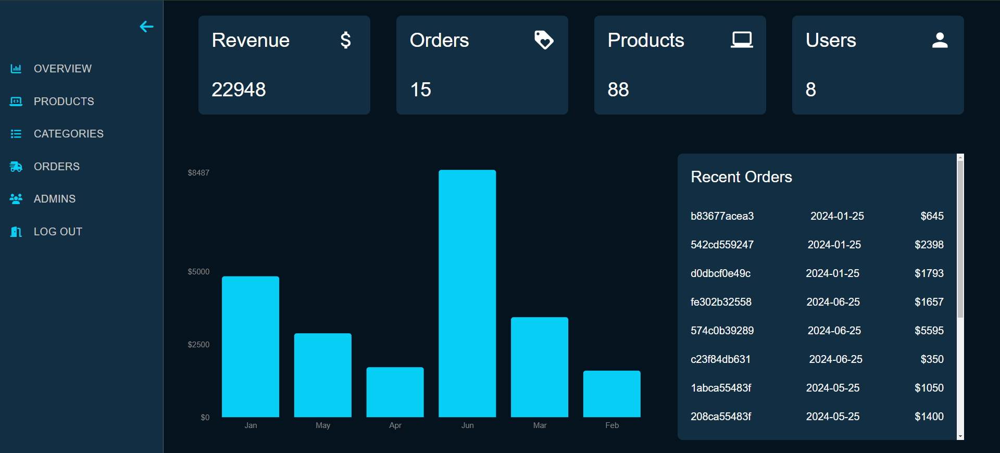
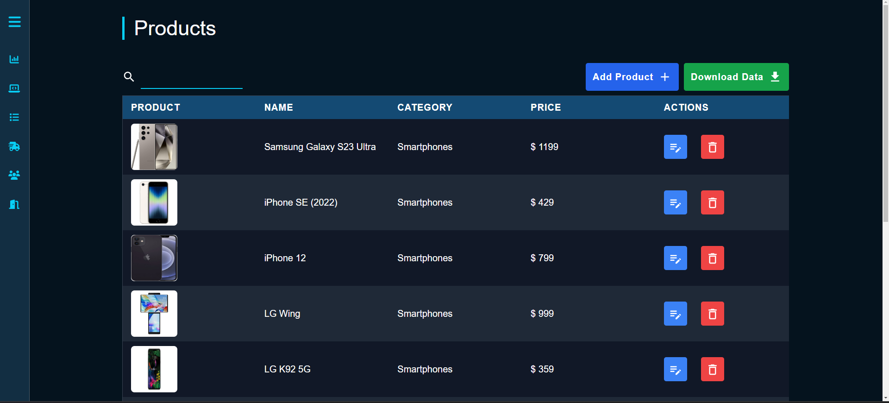

<h1 align="center" >
   Volt-Nation
</h1>

      
  <div id="top"></div>
  
  
  
  
  
  
  
  
  
  <div align="center">
    <br>
    
    <br>
    <br>
  </div>
  
  <!-- TABLE OF CONTENTS -->
  <details>
    <summary>Table of Contents</summary>
    <ol>
      <li>
        <a href="#about-the-project">About The Project</a>
        <ul>
          <li><a href="#features">Key Features</a></li>
          <li><a href="#built-with">Built With</a></li>
        </ul>
      </li>
      <li>
        <a href="#getting-started">Getting Started</a>
        <ul>
          <li><a href="#installation">Installation</a></li>
        </ul>
      </li>
    </ol>
  </details>
  
  <!-- ABOUT THE PROJECT -->
  ## About The Project
  
  Volt Nation is an e-commerce platform designed to provide users with a seamless online shopping experience. The platform includes a wide range of features aimed at enhancing user convenience, security, and accessibility.
  
  

  

  

  

  

  
  ### Features
  
  - **Filter & Search**
  - **Wishlist and Favorites**
  - **Order Status Selection**
  - **Responsive Web Design**
  - **Authentication & Authorization**
  - **User Admin Role Control**
  - **Category CRUD**
  - **Product CRUD**
  - **Download Data as Excel Sheet**
  - **Forgot Password Feature**
  - **Secure Payments via PayPal API**
  
  <p align="right">(<a href="#top">back to top</a>)</p>
  
  ---
  
  ## Built With
  
  - React
  - Redux Toolkit
  - MUI (Material-UI)
  - Tailwind CSS
  - XLSX
  - Tanstack Table
  - Recharts
  - React Query
  - React Hook Form
  - Yup Validation
  - PayPal API
  - React OAuth Google
  
  <p align="right">(<a href="#top">back to top</a>)</p>
  
  ---
  
  ## Getting Started
  
  This project requires some prerequisites and dependencies to be installed.
  
  > To get a local copy up and running, follow these simple steps:
  
  ### Installation
 </div>
  
1. Clone the repository
  
     ```sh
     git clone https://github.com/SayedShehata1/Volt-Nation

2. go to project folder
        
   ```sh
   cd Volt-Nation

   ```

3. install dependencies

   ```bash
   npm install
   ```

5. Run development server

   ```sh
   npm run dev
   ```
